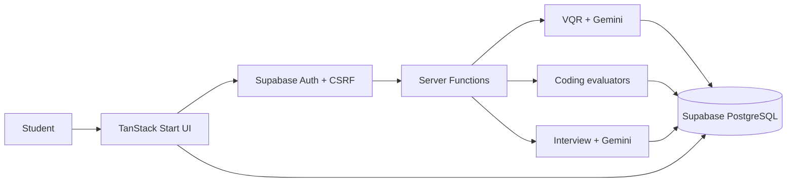
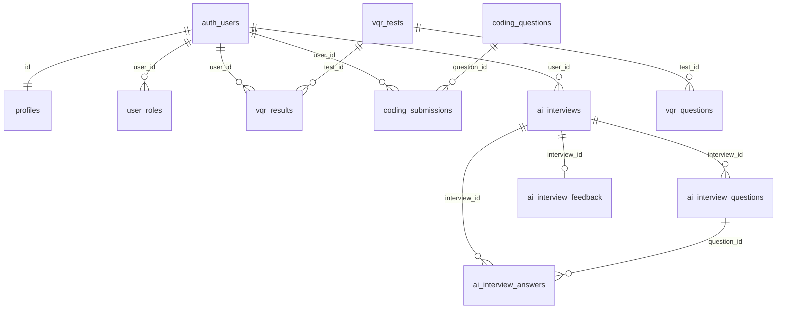
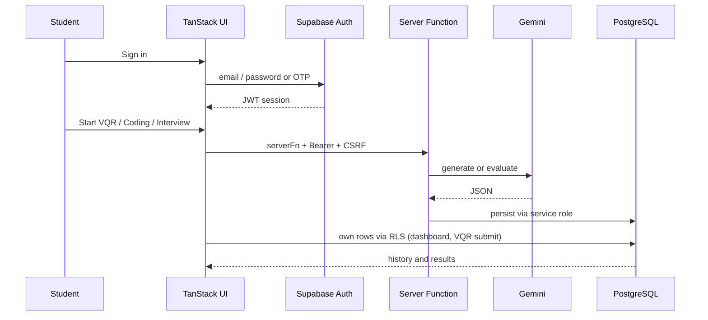

# Career Ace AI — Project Documentation

Career Ace AI (in-app branding: **EduAI**) is a web platform that helps students prepare for campus placements through aptitude tests, coding practice, and AI mock interviews. This document describes the **implemented** system only. Items that exist as unused schema or suggested hardening are labelled **Recommended**.

---

# 1. Functional Requirements

## 1.1 Email authentication (Supabase)

| Capability | Status |
| ---------- | ------ |
| Email + password sign-up and sign-in | **Implemented** |
| Magic-link / OTP sign-in (`signInWithOtp`) | **Implemented** |
| Sign-up metadata: full name, college, department, year | **Implemented** (stored on `profiles` via `handle_new_user`) |
| Session persistence and sign-out | **Implemented** |
| Route guard: unauthenticated users redirected to `/auth` | **Implemented** (`/_authenticated`) |
| Social / Google login | Not implemented |

## 1.2 Student Dashboard

| Capability | Status |
| ---------- | ------ |
| Welcome message with student name | **Implemented** |
| Daily motivation text and practice streak | **Implemented** (streak from VQR + coding dates) |
| Shortcuts to VQR, Coding, and AI Interview | **Implemented** |
| Recent VQR and coding attempts with scores | **Implemented** |
| Score-trend charts (VQR and coding) | **Implemented** (Recharts) |
| Profile (name, college, department, year, LinkedIn, avatar) | **Implemented** |
| AI Interview sessions in dashboard “Recent Tests” | **Not implemented** (sessions are stored; no dashboard list) |

## 1.3 VQR Test

| Capability | Status |
| ---------- | ------ |
| Categories: Quantitative, Reasoning, Verbal | **Implemented** |
| Topic lists per category and difficulty Easy / Medium / Hard | **Implemented** |
| Gemini-generated MCQs (target 10; accepts ≥ 5 valid) | **Implemented** |
| Timed attempt, shuffle, flag, auto-submit | **Implemented** |
| Client-side scoring; result page with score, accuracy, breakdown | **Implemented** |
| Results stored in `vqr_results` | **Implemented** |

## 1.4 Coding Test

| Capability | Status |
| ---------- | ------ |
| Python problems (function-based, local Python runner) | **Implemented** |
| Java and SQL problem generation and evaluation | **Implemented** (beyond the Python-only brief) |
| Topic + concept + difficulty selection | **Implemented** |
| Gemini-generated problems, starter code, examples, test cases | **Implemented** |
| Run and submit; test-case pass/fail, score, status | **Implemented** (`accepted` / `partial` / `failed`) |
| Per-problem submission history | **Implemented** |
| Optional Gemini feedback after submit | **Implemented** |

## 1.5 AI Interview

| Capability | Status |
| ---------- | ------ |
| Technical Interview with required role selection | **Implemented** (11 predefined roles) |
| Medium/Hard open-ended questions only | **Implemented** (`difficulty` stored as `medium-hard`) |
| Exactly 4 technical questions | **Implemented** |
| HR Interview with no role selection | **Implemented** |
| Exactly 4 HR questions | **Implemented** |
| Text answers | **Implemented** |
| Voice-to-text (browser Speech Recognition API) | **Implemented** |
| Per-answer Gemini evaluation (quality, communication, technical, confidence) | **Implemented** |
| Final strengths and improvement areas | **Implemented** (`ai_interview_feedback`) |

## 1.6 Student test / interview history

| Data | Where shown | Storage |
| ---- | ----------- | ------- |
| VQR results | Dashboard recent list + `/vqr/result/$resultId` | `vqr_results` |
| Coding submissions | Dashboard + problem Submissions tab | `coding_submissions` |
| AI interviews | During the session / result screen | `ai_interviews` and related tables |

**Recommended:** A dashboard (or dedicated) list of past AI interview sessions.

## 1.7 Admin functionality

**Implemented** (`/admin` and server functions):

- Admin sign-in (Supabase user `admin@prepai.local`; server also requires `user_roles.role = 'admin'`)
- List students with VQR averages and coding attempt/solved counts
- Reset a student’s `vqr_results`, `coding_submissions`, and `ai_feedback`
- Delete a student account (cannot delete self or another admin)

**Recommended:** Include AI interview tables in admin reset; avoid relying on a hardcoded client email as the only UI gate (server `assertAdmin` is the real control).

---

# 2. Non-Functional Requirements

| Area | Implemented behaviour | Recommended |
| ---- | --------------------- | ----------- |
| **Security** | Auth, RLS, CSRF on server functions, JWT on server functions, secrets on the server | Sandbox code execution; do not expose VQR answers / coding hidden tests to all clients |
| **Performance** | Server-side AI generation; local Python/Java/SQL evaluation; 8–10s process timeouts on evaluators | Cache or reuse generated tests if load grows |
| **Scalability** | Stateless UI + Supabase; AI and code eval on the app server | Dedicated worker/queue for Gemini and `execFile` |
| **Reliability** | Gemini retries on 429/5xx; VQR generation retries; SSR/error pages | Circuit breaker / user-facing retry for long AI calls |
| **Availability** | Single app + Supabase; Java path also uses public Piston API for one runner | Health checks; fallback if Gemini or Piston is down |
| **Maintainability** | Feature folders, TanStack server functions, typed Supabase schema, SQL migrations | Remove unused `ai_feedback` writes gap; document env vars |
| **Usability** | Responsive UI (Tailwind + shadcn/ui), toasts, timers, Monaco editor | Interview history UX |
| **Data privacy** | Per-user RLS; avatars in private storage with signed URLs | Data-retention / export policy |
| **API key protection** | `GEMINI_API_KEY`, `SUPABASE_SERVICE_ROLE_KEY` used only in server modules / env | Rotate keys; never ship service role to the client (already not imported from routes) |
| **Error handling** | Server-function throws, UI toasts, global SSR HTML error page | Structured error codes for AI vs DB failures |
| **AI timeout / retry** | Exponential backoff + jitter; VQR HTTP retry up to 4, generation up to 3; Interview HTTP retry up to 4; Coding AI retry up to 3 | Explicit HTTP timeout on Gemini SDK calls (not configured separately) |

---

# 3. System Design

```text
User
 ↓
React / TanStack Start Frontend
 ↓
Authentication + CSRF
 ↓
TanStack Server Functions
 ↓
 ┌──────────────┬───────────────┬──────────────┐
 │ VQR          │ Coding        │ AI Interview │
 └──────────────┴───────────────┴──────────────┘
        ↓              ↓               ↓
      Gemini         Python          Gemini
        ↓            Evaluator          ↓
        └──────────────┬───────────────┘
                       ↓
                    Supabase
```

| Component | Role |
| --------- | ---- |
| **React / TanStack Start UI** | File-based routes, student and admin screens. Client uses the Supabase JS client for auth, profiles, VQR attempts, and reading coding questions. |
| **Authentication + CSRF** | Browser session (Supabase JWT) is attached to server-function calls. CSRF middleware applies to server functions. |
| **TanStack Server Functions** | Authenticated RPC for Gemini generation, coding run/submit, AI interview lifecycle, and admin operations. |
| **VQR** | Generates MCQs with Gemini, persists `vqr_tests` / `vqr_questions`; the client times and scores the attempt. |
| **Coding** | Generates problems with Gemini; evaluates Python (local `python`), Java (`javac`/`java`), and SQL (`node:sqlite` in-memory). |
| **AI Interview** | Generates 4 questions, evaluates answers, and writes a final summary via Gemini. |
| **Gemini** | Google Generative AI (`@google/genai`); keys only on the server. |
| **Python evaluator** | Temporary script + `execFile("python", …, { timeout: 8000 })`. |
| **Supabase** | Auth (`auth.users`), PostgreSQL, Storage (`avatars`). |

Coding evaluation also includes Java (local JVM and, in one server function, the Piston HTTP API) and SQL (`DatabaseSync`). Those sit beside the Python evaluator, not in the diagram above.



---

# 4. Technology Stack

| Layer | Technology | Purpose |
| --------------- | ---------- | ------- |
| Frontend | React 19 | Student and admin user interfaces |
| Framework | TanStack Start, TanStack Router, Vite | SSR-capable app, file routes, server functions |
| Backend | TanStack server functions (Nitro / Vite server entry) | Authenticated generation, evaluation, admin APIs |
| AI | Google Gemini (`@google/genai`; models include `gemini-3.5-flash-lite`, `gemini-3.5-flash-lite`) | MCQs, coding problems, interview Q&A and feedback |
| Authentication | Supabase Auth | Email/password and magic-link sessions |
| Database | Supabase PostgreSQL | Profiles, tests, submissions, interviews |
| Storage | Supabase Storage (`avatars`) | Profile photos |
| Code Evaluation | Local Python (`execFile`), local Java (`javac`/`java`), Node `node:sqlite`; Piston API for one Java runner | Run tests and score submissions |
| Editor | Monaco Editor | In-browser code editing |
| Styling/UI | Tailwind CSS 4, shadcn/ui (Radix), Lucide, Sonner | Layout, components, icons, toasts |
| Charts | Recharts | Dashboard score trends |
| Development | TypeScript, ESLint, Prettier | Typed source and lint/format |

TanStack Query is registered on the router `QueryClient` but is not used for feature data fetching in application code. Zod is a dependency and is not used in `src`.

---

# 5. Database Schema

Source of truth: `supabase/migrations/` and `src/integrations/supabase/types.ts`. Enums: `app_role` (`admin`, `user`); `vqr_category`; `difficulty`; `coding_topic` (includes `sql`).

## 5.1 Users / student data

### `profiles`

**Purpose:** Student profile linked 1:1 with `auth.users`.

| Column | Notes |
| ------ | ----- |
| `id` | **PK**, FK → `auth.users(id)` ON DELETE CASCADE |
| `full_name`, `college`, `department`, `year`, `email` | Text |
| `linkedin_url`, `avatar_url` | Text (avatar is a storage path) |
| `created_at`, `updated_at` | Timestamps |

**Relationships:** One profile per auth user. Created by trigger `on_auth_user_created` → `handle_new_user()`.

### `user_roles`

**Purpose:** Application roles.

| Column | Notes |
| ------ | ----- |
| `id` | **PK** (uuid) |
| `user_id` | FK → `auth.users(id)` ON DELETE CASCADE |
| `role` | `app_role`; UNIQUE (`user_id`, `role`) |

New users receive `role = 'user'`. Function `has_role(_user_id, _role)` exists (SECURITY DEFINER); execute was later restricted to `service_role`.

### `auth.users` (Supabase)

Not a public table. Referenced by FKs. Email/password and OTP users live here.

---

## 5.2 VQR

### `vqr_tests`

**Purpose:** One aptitude test (seeded or AI-generated).

| Column | Notes |
| ------ | ----- |
| `id` | **PK** |
| `title`, `topic` | Text |
| `category` | `vqr_category` |
| `difficulty` | `difficulty` |
| `duration_minutes` | Default 30; AI tests use 15 (easy/medium) or 20 (hard) |
| `created_at` | Timestamp |

**FK:** none. **Relationships:** 1 → N `vqr_questions`, 1 → N `vqr_results`.

### `vqr_questions`

**Purpose:** Four-option MCQs.

| Column | Notes |
| ------ | ----- |
| `id` | **PK** |
| `test_id` | **FK** → `vqr_tests(id)` ON DELETE CASCADE |
| `question`, `option_a`–`option_d` | Text |
| `correct_answer` | `'a'` \| `'b'` \| `'c'` \| `'d'` |
| `topic`, `difficulty`, `explanation` | |

### `vqr_results`

**Purpose:** One student’s scored attempt.

| Column | Notes |
| ------ | ----- |
| `id` | **PK** |
| `user_id` | FK → `auth.users(id)` ON DELETE CASCADE |
| `test_id` | **FK** → `vqr_tests(id)` ON DELETE CASCADE |
| `score`, `total`, `accuracy`, `time_taken_seconds` | |
| `answers_json`, `topic_breakdown` | jsonb |
| `created_at` | |

---

## 5.3 Coding

### `coding_questions`

**Purpose:** Problem bank (seeded + AI-generated).

| Column | Notes |
| ------ | ----- |
| `id` | **PK** |
| `slug` | UNIQUE |
| `title`, `description`, `constraints` | |
| `difficulty`, `topic` | enums |
| `language` | Default `'python'` |
| `examples`, `starter_code`, `test_cases`, `hints` | jsonb |
| `tags` | `text[]` |
| `sql_schema` | Optional SQL setup |
| `created_at` | |

### `coding_submissions`

**Purpose:** Run/submit history.

| Column | Notes |
| ------ | ----- |
| `id` | **PK** |
| `user_id` | FK → `auth.users(id)` ON DELETE CASCADE |
| `question_id` | **FK** → `coding_questions(id)` ON DELETE CASCADE |
| `language`, `code`, `status` | |
| `score`, `passed_tests`, `total_tests`, `execution_time_ms` | |
| `submitted_at` | |

---

## 5.4 AI Interview

### `ai_interviews`

**Purpose:** One mock interview session.

| Column | Notes |
| ------ | ----- |
| `id` | **PK** |
| `user_id` | FK → `auth.users(id)` ON DELETE CASCADE |
| `interview_type` | `'technical'` \| `'hr'` |
| `role` | Nullable (null for HR) |
| `difficulty` | Default `'medium-hard'` |
| `total_questions` | Default 4 |
| `completed_questions`, `status` | `in_progress` / `completed` / `abandoned` |
| `overall_feedback`, `created_at`, `completed_at` | |

### `ai_interview_questions`

| Column | Notes |
| ------ | ----- |
| `id` | **PK** |
| `interview_id` | **FK** → `ai_interviews(id)` ON DELETE CASCADE |
| `question_number`, `question`, `category` | UNIQUE (`interview_id`, `question_number`) |
| `created_at` | |

### `ai_interview_answers`

| Column | Notes |
| ------ | ----- |
| `id` | **PK** |
| `interview_id` | **FK** → `ai_interviews(id)` ON DELETE CASCADE |
| `question_id` | **FK** → `ai_interview_questions(id)` ON DELETE CASCADE |
| `user_id` | FK → `auth.users(id)` ON DELETE CASCADE |
| `answer_text`, `input_method` | `'text'` \| `'voice'` |
| Feedback fields + `answer_quality` | |
| UNIQUE (`interview_id`, `question_id`) | |

### `ai_interview_feedback`

| Column | Notes |
| ------ | ----- |
| `id` | **PK** |
| `interview_id` | **FK** → `ai_interviews(id)` ON DELETE CASCADE, UNIQUE |
| `strengths`, `improvements` | `text[]` |
| Communication / technical / confidence / personality / cultural-fit / `final_summary` | |

---

## 5.5 Other

### `ai_feedback`

| Column | Notes |
| ------ | ----- |
| `id` | **PK** |
| `user_id` | FK → `auth.users(id)` ON DELETE CASCADE |
| `test_type`, `feedback` | |
| `strengths`, `weaknesses`, `recommendations` | jsonb |
| `created_at` | |

**Purpose in schema:** generic AI feedback rows. **Application writes:** none found. Admin reset **deletes** this table for a student. Treat as unused / leftover.

### Storage: `avatars`

Not a SQL table. RLS on `storage.objects`: users may CRUD objects whose first folder name is their `auth.uid()`.



---

# 6. Database Security

## 6.1 Implemented

### Supabase Authentication

Sessions use the publishable key and the user’s JWT. Authenticated layouts call `supabase.auth.getUser()`. Sign-up inserts `auth.users`; the trigger creates `profiles` and a `user` role.

### Row Level Security (RLS)

RLS is enabled on the public tables below. Policies are ownership- or “authenticated read” based.

| Table | Policies (implemented) |
| ----- | ---------------------- |
| `profiles` | SELECT / INSERT / UPDATE own row (`auth.uid() = id`) |
| `user_roles` | SELECT own rows |
| `vqr_tests` | SELECT for all authenticated |
| `vqr_questions` | SELECT for all authenticated |
| `vqr_results` | ALL for own `user_id` |
| `coding_questions` | SELECT for all authenticated |
| `coding_submissions` | ALL for own `user_id` |
| `ai_feedback` | ALL for own `user_id` |
| `ai_interviews` | SELECT / INSERT / UPDATE / DELETE own `user_id` |
| `ai_interview_questions` | SELECT / INSERT if parent interview belongs to user |
| `ai_interview_answers` | SELECT / INSERT / UPDATE own `user_id` |
| `ai_interview_feedback` | SELECT / INSERT if parent interview belongs to user |
| `storage.objects` (avatars) | CRUD when folder is `auth.uid()` |

### User ownership checks

- Client inserts (`vqr_results`) set `user_id` from the current session; RLS `WITH CHECK (auth.uid() = user_id)` rejects another student’s id.
- Interview server functions load rows with `.eq("user_id", userId)` from the verified JWT (`context.userId`).
- Coding submissions insert `user_id` from `context.userId`.
- Dashboard queries `profiles` / results / submissions without a foreign user id.

### Server-side database access

`supabaseAdmin` uses `SUPABASE_SERVICE_ROLE_KEY` and **bypasses RLS**. It is constructed only in `client.server.ts` and loaded inside server handlers (dynamic import from `*.functions.ts` so the key is not bundled for the browser).

### Service-role key protection

- Stored in server environment (`process.env.SUPABASE_SERVICE_ROLE_KEY`).
- Comments in code require it never be used from client modules.
- Browser client uses `VITE_SUPABASE_PUBLISHABLE_KEY` / `SUPABASE_PUBLISHABLE_KEY` only.

### API key protection

- `GEMINI_API_KEY` is read in `*.server.ts` modules only.
- Generation and evaluation run on the server, not in the browser.

### CSRF protection

`createCsrfMiddleware` in `src/start.ts` is applied to requests where `handlerType === "serverFn"`.

### Server-function authentication

- Global function middleware `attachSupabaseAuth` adds `Authorization: Bearer <access_token>`.
- Protected functions use `requireSupabaseAuth`: requires a Bearer JWT, validates claims via `getClaims`, and sets `userId`.
- Admin functions call `assertAdmin` (row in `user_roles` with `role = 'admin'`).

### Protection against another student’s results

| Path | Mechanism |
| ---- | --------- |
| Direct table read of `vqr_results` / `coding_submissions` | RLS own-row |
| AI interview fetch/submit/complete | JWT `userId` filter + (for browser) RLS |
| Admin student list / delete / reset | Authenticated server function + `assertAdmin` |

## 6.2 Recommended

- **VQR answer leakage:** any authenticated user can `SELECT` all `vqr_questions`, including `correct_answer`. Scoring is done in the browser. Restrict question reads or hide answers until after submit; score on the server.
- **Coding test-case leakage:** `coding_questions` (including `test_cases`) is readable by all authenticated users. Serve public examples only; keep hidden tests server-side.
- **Service-role blast radius:** admin client bypasses RLS; keep all service-role usage behind authz checks (already true for admin and interview handlers).
- **Admin reset:** does not delete `ai_interviews` (and child rows).
- **Client-writable results:** a student can insert arbitrary `vqr_results` for themselves. Server-side scoring would prevent inflated scores.
- **Code execution:** local `python`/`java` is not a full sandbox. Isolate or containerize evaluators.
- **Gemini timeouts:** retries exist; add an explicit request timeout.

---

# 7. Complete Architecture

```text
                         ┌──────────────┐
                         │    Student   │
                         └──────┬───────┘
                                │
                                ▼
                    ┌─────────────────────┐
                    │ React / TanStack UI │
                    └──────────┬──────────┘
                               │
                    ┌──────────▼──────────┐
                    │ Auth + CSRF Layer   │
                    └──────────┬──────────┘
                               │
                    ┌──────────▼──────────┐
                    │ Server Functions     │
                    └──────────┬──────────┘
                               │
             ┌─────────────────┼─────────────────┐
             ▼                 ▼                 ▼
        ┌─────────┐       ┌─────────┐      ┌────────────┐
        │   VQR   │       │ Coding  │      │AI Interview│
        └────┬────┘       └────┬────┘      └──────┬─────┘
             │                 │                  │
             ▼                 ▼                  ▼
          Gemini           Python Engine        Gemini
             │                 │                  │
             └─────────────────┼──────────────────┘
                               ▼
                        ┌────────────┐
                        │  Supabase  │
                        │ PostgreSQL │
                        └────────────┘
```

Admin users use the same stack (`/admin` → `listStudents` / `resetStudentProgress` / `deleteStudent`).

## 7.1 User authentication

1. Student opens `/auth` and signs up, signs in with password, or requests a magic link.
2. Supabase Auth creates/validates `auth.users` and a session (JWT in localStorage).
3. On first sign-up, `handle_new_user` inserts `profiles` and `user_roles` (`user`).
4. Routes under `/_authenticated` run `getUser()`; missing session redirects to `/auth`.
5. Server functions receive the Bearer token, validate claims, and obtain `userId`.

## 7.2 VQR test generation and submission

1. Student selects category, topic, and difficulty on `/vqr`.
2. `generateVqrTest` (auth + CSRF) calls Gemini, then `supabaseAdmin` inserts `vqr_tests` and `vqr_questions`.
3. UI loads the test and questions from Supabase (authenticated client).
4. Timer runs; answers stay in React state. On submit (or timeout), the client computes score and inserts `vqr_results` (RLS: own `user_id`).
5. User is sent to `/vqr/result/$resultId`, which loads that result (own row only).

## 7.3 Coding problem generation and evaluation

1. Student picks language (Python / Java / SQL), topic, concept, and difficulty.
2. `generateCodingProblem` calls Gemini and inserts `coding_questions` (unique `slug`).
3. Editor loads the question (including starter code). Run/submit call `runCodingCode` / `submitCodingCode`.
4. Server loads test cases and runs the matching evaluator (Python timeout 8s; Java compile 10s / run 5s; SQL in-memory SQLite).
5. Submit inserts `coding_submissions` for `context.userId` and may attach Gemini code feedback.

## 7.4 AI Interview question generation

1. Technical: student picks a role → `createTechnicalInterview` → Gemini (4 medium–hard questions) → insert `ai_interviews` + `ai_interview_questions`.
2. HR: no role → `createHrInterview` → four HR questions stored the same way.
3. Session is bound to `user_id` from the JWT.

## 7.5 AI Interview answer evaluation

1. Student answers by text and/or voice-to-text (`input_method` stored).
2. `submitInterviewAnswer` verifies interview ownership, loads the question, and calls Gemini (technical vs HR evaluator).
3. Result is upserted into `ai_interview_answers`; `completed_questions` is updated.
4. After four answers, `completeInterview` synthesizes a summary, upserts `ai_interview_feedback`, and sets status `completed`.

## 7.6 Result storage and retrieval

| Feature | Write | Read |
| ------- | ----- | ---- |
| VQR | Client insert `vqr_results` | Client by `id` + RLS; dashboard lists own rows |
| Coding | Server insert `coding_submissions` | Client by `user_id` + RLS |
| Interview | Server inserts/updates interview tables | `getInterviewDetails` filtered by `user_id`; RLS for direct access |
| Admin | Service role aggregates / deletes | After `assertAdmin` only |



---

*Document version: aligned with the repository as of August 2026. Do not treat unused tables or Recommended items as delivered features.*
